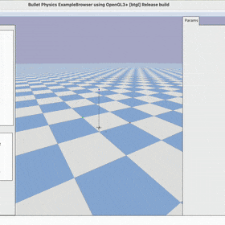

# gym-pybullet-drones

This is an updated repository of the original [`gym-pybullet-drones`](https://github.com/utiasDSL/gym-pybullet-drones) repository, designed for compatibility with [`gymnasium`](https://github.com/Farama-Foundation/Gymnasium), [`stable-baselines3` 2.0](https://github.com/DLR-RM/stable-baselines3/pull/1327), and SITL [`betaflight`](https://github.com/betaflight/betaflight)/[`crazyflie-firmware`](https://github.com/bitcraze/crazyflie-firmware/). The new repository does not have compatible examples of drones flying. 

# Main Contrbution
My contribution to this repository is the enhancement for complex urban flight scenarios, which is implemented in the FlyThruGateAviary within the env folder. This update includes modifications to the reward function to better target the desired goals.

> **NOTE**: if you prefer to access the original codebase, presented at IROS in 2021, please see [`gym-pybullet-drones`](https://github.com/utiasDSL/gym-pybullet-drones) `git checkout [paper|master]` after cloning the repo, and refer to the corresponding `README.md`'s.

 

## Installation

Tested on Intel x64/Ubuntu 22.04.

```sh
git clone https://github.com/abdul-mannan-khan/gym-pybullet-drones.git
cd gym-pybullet-drones/

conda create -n drones python=3.10
conda activate drones
```
**Create a virtual environment**: This is a necessary isolates for your package installations from the global Python environment.
```
# make sure that you are inside gym-pybullet-drones 
python -m venv drones_env
```
**Activate the virtual environment**
```
source drones_env/bin/activate
```
Next, install the repository 

```
pip3 install --upgrade pip
pip3 install -e . # if needed, `sudo apt install build-essential` to install `gcc` and build `pybullet`

```

## Container Installation

pip3 install tensorflow==2.12


## Use

### PID control examples

```sh
cd gym_pybullet_drones/examples/
python3 pid.py # position and velocity reference
python3 pid_velocity.py # desired velocity reference
```

### Downwash effect example

```sh
cd gym_pybullet_drones/examples/
python3 downwash.py
```

### Reinforcement learning examples (SB3's PPO)

```sh
cd gym_pybullet_drones/examples/
python learn.py # task: single drone hover at z == 1.0
python learn.py --multiagent true # task: 2-drone hover at z == 1.2 and 0.7
```

 

### utiasDSL `pycffirmware` Python Bindings example (multiplatform, single-drone)

Install [`pycffirmware`](https://github.com/utiasDSL/pycffirmware?tab=readme-ov-file#installation) for Ubuntu, macOS, or Windows

```sh
cd gym_pybullet_drones/examples/
python3 cff-dsl.py
```

### Betaflight SITL example (Ubuntu only)

```sh
git clone https://github.com/betaflight/betaflight # use the `master` branch at the time of writing (future release 4.5)
cd betaflight/ 
make arm_sdk_install # if needed, `apt install curl``
make TARGET=SITL # comment out line: https://github.com/betaflight/betaflight/blob/master/src/main/main.c#L52
cp ~/gym-pybullet-drones/gym_pybullet_drones/assets/eeprom.bin ~/betaflight/ # assuming both gym-pybullet-drones/ and betaflight/ were cloned in ~/
betaflight/obj/main/betaflight_SITL.elf
```

In another terminal, run the example

```sh
conda activate drones
cd gym_pybullet_drones/examples/
python3 beta.py --num_drones 1 # check the steps in the file's docstrings to use multiple drones
```
# Drone Simulation Action Types and Physics Models

## Action Types

In our drone simulation, we utilize a variety of action types to control drone behavior under different scenarios. Here's an overview of the action types available:

- **RPM (`rpm`)**: Controls the revolutions per minute of each motor.
- **Dynamic (`dyn`)**: Manages the desired thrust and torques applied to the drone.
- **PID (`pid`)**: Implements Proportional-Integral-Derivative control logic to manage drone stability and responsiveness.
- **Velocity (`vel`)**: Directly controls the drone's velocity, typically managed via PID controllers.
- **One Dimensional RPM (`one_d_rpm`)**: Applies a uniform RPM value across all motors.
- **One Dimensional Dynamic (`one_d_dyn`)**: Uniformly applies thrust and torque across all motors.
- **One Dimensional PID (`one_d_pid`)**: Uses a single PID control setup across all motors, simplifying the control scheme.

## Physics Models

To accurately simulate physical interactions and drone dynamics, we support several physics models:

- **PYB (`pyb`)**: Standard PyBullet physics.
- **Dynamic (`dyn`)**: A more detailed dynamics model.
- **PyBullet with Ground Effect (`pyb_gnd`)**: Enhances PyBullet with ground effect simulations.
- **PyBullet with Drag (`pyb_drag`)**: Adds drag calculations to the physics simulations.
- **PyBullet with Downwash (`pyb_dw`)**: Incorporates downwash effects.
- **PyBullet with Ground Effect, Drag, and Downwash (`pyb_gnd_drag_dw`)**: Combines ground effect, drag, and downwash for a comprehensive physics simulation.

## Implementation Details

To implement these action types and physics models in your project, ensure you have the following dependencies:

- Python 3.8 or later
- PyBullet
- NumPy

You can set the desired action type and physics model through the simulation environment's configuration settings. This flexibility allows for extensive testing and research into different control strategies and their effects on drone behavior under varying physical conditions.

## Usage

```python
from drone_env import DroneEnvironment

# Initialize the environment with specific action and physics settings
env = DroneEnvironment(action_type='pid', physics_model='pyb_gnd_drag_dw')

## Citation

If you wish, please cite our [IROS 2021 paper](https://arxiv.org/abs/2103.02142) ([and original codebase](https://github.com/utiasDSL/gym-pybullet-drones/tree/paper)) as

```bibtex
@INPROCEEDINGS{panerati2021learning,
      title={Learning to Fly---a Gym Environment with PyBullet Physics for Reinforcement Learning of Multi-agent Quadcopter Control}, 
      author={Jacopo Panerati and Hehui Zheng and SiQi Zhou and James Xu and Amanda Prorok and Angela P. Schoellig},
      booktitle={2021 IEEE/RSJ International Conference on Intelligent Robots and Systems (IROS)},
      year={2021},
      volume={},
      number={},
      pages={7512-7519},
      doi={10.1109/IROS51168.2021.9635857}
}
```

## References

- Carlos Luis and Jeroome Le Ny (2016) [*Design of a Trajectory Tracking Controller for a Nanoquadcopter*](https://arxiv.org/pdf/1608.05786.pdf)
- Nathan Michael, Daniel Mellinger, Quentin Lindsey, Vijay Kumar (2010) [*The GRASP Multiple Micro UAV Testbed*](http://citeseerx.ist.psu.edu/viewdoc/download?doi=10.1.1.169.1687&rep=rep1&type=pdf)
- Benoit Landry (2014) [*Planning and Control for Quadrotor Flight through Cluttered Environments*](http://groups.csail.mit.edu/robotics-center/public_papers/Landry15)
- Julian Forster (2015) [*System Identification of the Crazyflie 2.0 Nano Quadrocopter*](https://www.research-collection.ethz.ch/handle/20.500.11850/214143)
- Antonin Raffin, Ashley Hill, Maximilian Ernestus, Adam Gleave, Anssi Kanervisto, and Noah Dormann (2019) [*Stable Baselines3*](https://github.com/DLR-RM/stable-baselines3)
- Guanya Shi, Xichen Shi, Michael O’Connell, Rose Yu, Kamyar Azizzadenesheli, Animashree Anandkumar, Yisong Yue, and Soon-Jo Chung (2019)
[*Neural Lander: Stable Drone Landing Control Using Learned Dynamics*](https://arxiv.org/pdf/1811.08027.pdf)
- C. Karen Liu and Dan Negrut (2020) [*The Role of Physics-Based Simulators in Robotics*](https://www.annualreviews.org/doi/pdf/10.1146/annurev-control-072220-093055)
- Yunlong Song, Selim Naji, Elia Kaufmann, Antonio Loquercio, and Davide Scaramuzza (2020) [*Flightmare: A Flexible Quadrotor Simulator*](https://arxiv.org/pdf/2009.00563.pdf)

## Core Team WIP

- [ ] Multi-drone `crazyflie-firmware` SITL support (@spencerteetaert, @JacopoPan)
- [ ] Use SITL services with steppable simulation (@JacopoPan)

## Desired Contributions/PRs

- [ ] Add motor delay, advanced ESC modeling by implementing a buffer in `BaseAviary._dynamics()`
- [ ] Replace `rpy` with quaternions (and `ang_vel` with body rates) by editing `BaseAviary._updateAndStoreKinematicInformation()`, `BaseAviary._getDroneStateVector()`, and the `.computeObs()` methods of relevant subclasses

## Troubleshooting

- On Ubuntu, with an NVIDIA card, if you receive a "Failed to create and OpenGL context" message, launch `nvidia-settings` and under "PRIME Profiles" select "NVIDIA (Performance Mode)", reboot and try again.

Run all tests from the top folder with

```sh
pytest tests/
```

-----
> University of Toronto's [Dynamic Systems Lab](https://github.com/utiasDSL) / [Vector Institute](https://github.com/VectorInstitute) / University of Cambridge's [Prorok Lab](https://github.com/proroklab)

## Contributor: 
[Abdul Manan Khan](https://github.com/abdul-mannan-khan)

Learned from YouTube Official [Tutorial](https://www.youtube.com/watch?v=i_23KUAEtUM)
